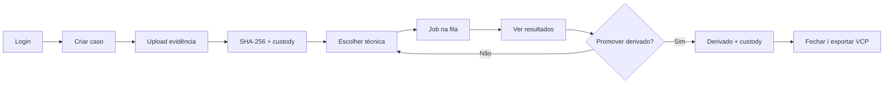

# 01 — Visão e negócio

## O que é

**ForensicAuth**  é uma plataforma web **local/offline** para peritos criminais analisarem autenticidade e manipulação de **imagem, áudio, vídeo e PDF**, com:

- organização por **casos** e **evidências**;
- execução de **técnicas forenses** (clássicas e ML);
- **cadeia de custódia digital** (hashes + elos encadeados + assinatura Ed25519);
- transferência de casos (**VCP** / Peritus).

Cada técnica entrega seus artefatos; a peça de transferência entre instâncias é o VCP.

Analogia: uma **laboratório** de evidências, instrumentos (plugins), motores GPU compartilhado e um livro de protocolo/custódia.

## Problema que resolve

Unificar dezenas de métodos espalhados em notebooks/legados numa aplicação multiusuário, auditável e reprodutível, sem depender de APIs de nuvem de modelo externas e fora do domínio da organização.

## Quem usa

| Perfil | Role | Faz |
|--------|------|-----|
| **Admin** | `admin` | Usuário com visão ampla de auditoria |
| **Perito** | `perito` | Casos, uploads, técnicas, shares, fechamento, VCP |

Colaboração: **CaseShare** (viewer/editor).

## Fluxo

## Regras de negócio essenciais

| ID | Regra |
|----|-------|
| RN-01 | Hash SHA-256 da evidência **antes** de processar |
| RN-02 | Job persiste params + hashes (sem elo automático de custódia) |
| RN-03 | Custódia **INSERT-only**; hoje o banco impõe isso diretamente apenas no SQLite |
| RN-04 | Jobs GPU **serializados por lock/fila configurada** |
| RN-06 | Só Admin cria usuários |
| RN-08 | Algoritmos em `forensics/` e `vendor/` não se reescrevem sem equivalência |

Fonte: [`specs/00-overview.md`](specs/00-overview.md).

## O que o produto *não* faz

- SaaS com modelos na nuvem  
- Gerador de **laudo**  
- Registro de **todo** job exploratório na custódia, apenas derivados  
- Garantia de operação offline antes de provisionar vendors, pesos e referências

## Limites atuais importantes

- A promessa INSERT-only ainda precisa de proteção equivalente no PostgreSQL
  (trigger ou privilégios); a camada de serviço, sozinha, não é uma barreira de
  banco.
- Algumas rotas por `job_id` não reaplicam consistentemente a ACL do caso. UUID
  não é autorização; veja [04 — Backend](04-backend.md).
- A interface ainda carrega Google Fonts externamente. Portanto, “offline”
  descreve o objetivo arquitetural, mas esse detalhe do frontend permanece uma
  dívida conhecida.

## Como verificar

1. Login → caso → upload com hash.  
2. Técnica CPU → job completed **sem** novo elo de custódia.  
3. Promover derivado → elo `derivative_saved`.

## Próximo

[02 — Arquitetura e decisões](02-arquitetura-e-decisoes.md)
