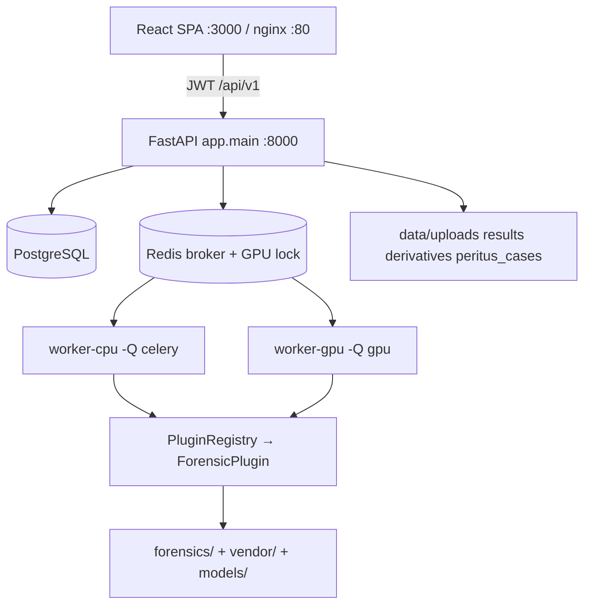
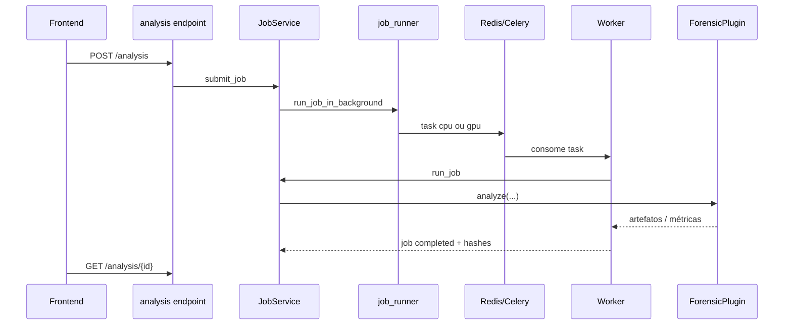

# 02 — Arquitetura e decisões

## Visão em uma figura

Stack confirmada: FastAPI + SQLAlchemy + Celery + Redis + PostgreSQL + React/Vite + Docker Compose. Spec: [`specs/01-architecture.md`](specs/01-architecture.md).

## Estilo arquitetural

**Monolito modular** (ADR-001): um codebase, pacotes internos (`api`, `services`, `core`, `forensics`). Workers são processos do mesmo código, não serviços independentes.

## Camadas (paths)

| Camada | Path | Papel |
|--------|------|-------|
| UI | `src/frontend/` | Páginas, registry de técnicas, cliente HTTP |
| API | `src/backend/api/v1/endpoints/` | Contratos REST |
| App | `src/backend/app/` | `main`, `config`, `celery_app`, `dependencies` |
| Serviços | `src/backend/services/` | Regras de negócio |
| Core | `src/backend/core/` | Plugins, GPU dispatch, LR/typicality |
| Motores 1P | `src/backend/forensics/` | Algoritmos (protegidos) |
| Terceiros | `vendor/` | Código 3P (protegido) |
| ORM | `src/backend/models/` | Entidades |
| Tasks | `src/backend/tasks/` | Celery |

## Decisões importantes

| Decisão | Motivo | Onde ver |
|---------|--------|----------|
| Monolito modular | Deploy local único, menos rede | Spec ADR-001 |
| Filas `celery` vs `gpu` | Isolar VRAM | `core/gpu_inference.py`, `celery_app.py` |
| Custódia seletiva | Jobs exploratórios não poluem a cadeia | Spec jobs + `JobService` |
| Plugins + registry | UI/API desacoplados do algoritmo | `core/forensic_plugin.py` |
| Offline | Conformidade / air-gap institucional | RNF-01 |
| Standby plugins | Reserva no registry; sem nomes ativos | `STANDBY_PLUGIN_NAMES` (vazio) |

## Fronteiras

- **Frontend** nunca acessa DB ou disco forense — só `/api/v1`.  
- **Plugin** orquestra; **não** reimplementa o motor (`AGENTS.md` Regra 8).  
- **API ↔ Worker**: Redis + DB + filesystem compartilhado (`data/`, `models/`).

## Fluxo de chamada — análise (visão arquitetural)

## Riscos arquiteturais (resumo)

| Risco | Nível | Mitigação |
|-------|-------|-----------|
| Worker GPU ausente | Alto | Monitorar fila; Compose GPU |
| Redis down | Crítico | Health + restart;  |
| Alterar `forensics/`/`vendor/` | Crítico | Teste de equivalência + aprovação |

## Como verificar

- `GET /health` na API.  
- Com Compose: containers `db`, `redis`, `app`, `worker` (e `worker-gpu` se GPU).  
- Listar técnicas: `GET /api/v1/analysis/techniques` (autenticado).

## Próximo

[03 — Mapa do repositório](03-mapa-do-repositorio.md)
