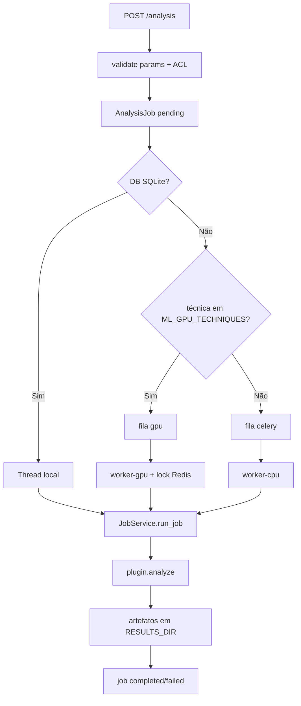

# 04 — Backend

## O que é

O backend é a API FastAPI em `src/backend/` que autentica usuários, persiste casos/evidências, enfileira análises e orquestra plugins forenses.

Ambiente conda: **`forensicauth`** (`environment.yml`).

## Pacotes principais

| Pacote | Path | Responsabilidade |
|--------|------|------------------|
| app | `app/` | FastAPI, config, DB, Celery, deps JWT |
| api | `api/v1/endpoints/` | Rotas HTTP |
| services | `services/` | Regras de negócio |
| core | `core/` | Plugins, GPU, LR |
| forensics | `forensics/` | Motores 1º partido |
| models | `models/` | SQLAlchemy |
| tasks | `tasks/` | Tasks Celery |
| lib | `lib/native/` | Ex.: `libzero.so_` (ZERO grid) |

## App e routers

Arquivo: `app/main.py`.

Montagem típica (prefixo `/api/v1`):

| Router | Tags / tema |
|--------|-------------|
| `auth` | login, first-access, me, register |
| `users` | admin de usuários |
| `cases` | casos |
| `evidences` | upload / download |
| `analysis` | jobs, techniques, gpu-queue, results |
| `audit` | custódia, verify, signing-keys |
| `prnu` | fingerprints PRNU |
| `references` | catálogos LR |
| `case_shares` / `case_transfer` / `peritus_transfer` | colaboração e VCP |

Também: `GET /health`.

## Autenticação e autorização


- Senhas: bcrypt (`services/auth_service.py`).  
- JWT: `app/dependencies.py`.  
- ACL de caso: owner, assigned, share viewer/editor, admin (`services/case_access.py`).  
- Caso **fechado**: mutações → HTTP 409.

## Domínio persistido (ORM)

Entidades em `models/`: `User`, `Case`, `Evidence`, `AnalysisJob`, `CustodyRecord`, `CaseShare`, `CaseClosure`, `CaseClosureSignature`. Não há modelo/API de laudo unificado (`reports` removido).

Tipos de evidência: `imagem` | `audio` | `video` | `pdf` .

## Fluxo crítico: upload

1. Endpoint evidences → `EvidenceService.upload`  
2. Grava em `UPLOAD_DIR` (`data/uploads`)  
3. Calcula SHA-256  
4. Insere `Evidence`  
5. `CustodyService.create_record(evidence_upload)`  

## Fluxo crítico: análise



Arquivos-chave:

- `services/job_service.py` — valida, instancia plugin, executa  
- `services/job_runner.py` — escolhe Celery vs thread  
- `tasks/analysis_tasks.py` — `run_forensic_analysis_cpu` / `_gpu`  
- `core/job_dispatch.py` + `core/gpu_inference.py` — roteamento GPU  

**Importante:** conclusão de job **não** cria elo de custódia. Custódia oficial: upload, derivado, lifecycle, import.

## Plugins forenses

### Contrato

`core/forensic_plugin.py` — classe abstrata `ForensicPlugin`:

- `name`, `supported_types`  
- `analyze(...)`, `validate_parameters(...)`  
- opcional: schemas, manifests de reprodutibilidade  

### Registry

`core/plugin_registry.py` descobre `core/plugins/*.py` e **pula** nomes em `STANDBY_PLUGIN_NAMES` (conjunto reservado; vazio no momento).

### Camadas

```text
Adapter (core/plugins/*_plugin.py ou *_adapter.py)
    → orquestra
Motor (forensics/... ou vendor/...)
    → algoritmo / modelo
```

Exemplos de nomes ativos: `prnu`, `jpeg_ghosts`, `synthetic_image_detection`, `audio_spoofing_detection`, `isomedia_parser`, `pdf_forensic_extract`, …

Guia para nova técnica: [`developer/03-scaffold-technique.md`](developer/03-scaffold-technique.md).

## Custódia

`services/custody_service.py` + assinatura `custody_signing_service.py`:

- elos com `previous_record_hash` → `record_hash`  
- assinatura Ed25519 opcional/configurada  
- API: `audit` + verify forense  

Leitura aprofundada: [`public/CADEIA-CUSTODIA-E-VERIFICACAO-FORENSE.md`](public/CADEIA-CUSTODIA-E-VERIFICACAO-FORENSE.md).

## Serviços (mapa mental)

| Área | Módulos típicos |
|------|-----------------|
| Auth/users | `auth_service`, `user_service` |
| Casos | `case_access`, `case_lifecycle_service`, `case_share_service`, `case_transfer_service` |
| Evidência | `evidence_service`, `derivative_service`, `thumbnail_service` |
| Jobs | `job_service`, `job_runner`, `gpu_queue_service` |
| Custódia | `custody_*`, `forensic_integrity_service` |
| Peritus | `peritus_*` |
| PRNU | `prnu_fingerprint_service` |

## Variáveis relevantes

Definidas via env / `app/config.py`: `DATABASE_URL`, `REDIS_URL` / Celery broker, `UPLOAD_DIR`, `RESULTS_DIR`, `DERIVATIVES_DIR`, `MODELS_DIR`, chaves de custody, `FORENSICAUTH_PROCESS_ROLE` (`api` | `worker-cpu` | `worker-gpu`).

Templates: `src/backend/.env.api.example`, `.env.worker-cpu.example`, `.env.worker-gpu.example`.

## Como verificar

```bash
cd src/backend
conda activate forensicauth
uvicorn app.main:app --reload --host 0.0.0.0 --port 8000
curl -s http://127.0.0.1:8000/health
```

Listar plugins ativos: autenticar e chamar `/api/v1/analysis/techniques`, ou inspecionar `PluginRegistry` / `STANDBY_PLUGIN_NAMES`.

## Armadilhas

- Spec antiga pode citar `adapters/` → no código é `core/plugins/`.  
- Sem Redis + worker, jobs em Postgres ficam `pending`.  
- Warmup ML só no processo `worker-gpu` (API não deve comer VRAM).

## Próximo

[05 — Frontend](05-frontend.md)
