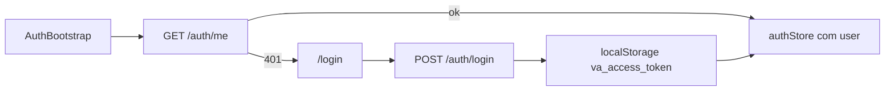
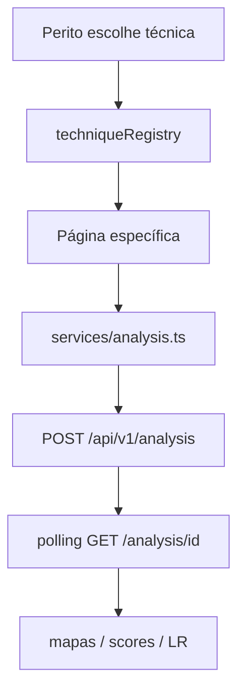

# 05 — Frontend

## O que é

SPA em **React 18 + TypeScript + Vite 5** em `src/frontend/`. Consome apenas a API (`/api/v1`) via Axios; em desenvolvimento o Vite faz proxy para `http://127.0.0.1:8000`.

Dependências de app: React Router 6, TanStack Query, Zustand.

## Como sobe

```bash
cd src/frontend
npm install
npm run dev -- --host 0.0.0.0 --port 3000
```

Produção: imagem nginx no Compose (`frontend` service).

## Auth na UI



Arquivos: `store/authStore.ts`, `services/auth.ts`, `services/api.ts` (interceptor Bearer), `ProtectedRoute`.

Rota admin: `/users` com `requiredRole="admin"`.

## Rotas principais

Definidas em `src/App.tsx` (paths aproximados):

| Path | Função |
|------|--------|
| `/login`, `/primeiro-acesso` | Público |
| `/`, `/dashboard` | Lista / dashboard de casos |
| `/cases/new`, `/cases/:caseId` | CRUD / detalhe (banner de integridade, paginação e **rótulos de questionados**) |
| `/analysis`, `/analysis/run` | Hubs de análise |
| `/cases/:caseId/analysis/...` | Técnica, grupos IMDL/mídia, áudio |
| `/users` | Admin |

## Technique registry (fluxo UI → API)

O mapa **técnica → página React** está em `src/frontend/src/config/techniqueRegistry.tsx`.



**Regra:** o `name` do plugin no backend deve casar (ou ter alias) com o ID no registry.

### Cards de mídia e hub de áudio

Nas abas Áudio / Vídeo / PDF do caso, os cards vêm de `config/mediaAnalysisGroups.ts` (imagem usa `imageAnalysisGroups.ts`).

Áudio forense (espectrograma, ENF, LTAS, níveis, DC) é **um card** `audio-forense` que abre o hub `__audio_hub__` (`AudioForensicsHub`). Aliases legados `audio-espectral` / `audio-niveis` redirecionam para esse grupo. Deep-links das técnicas `audio_*` forçam grupo/aba no hub (`caseAnalysisNav`), sem página plana no registry.

Casos `storage_mode=peritus`: na execução de técnicas, a UI lista “Arquivos Peritus importados” e materializa Evidence sob demanda a partir do workspace.

## Exclusão destrutiva (evidências, referências, derivados)

Toda exclusão passa por `components/ConfirmDestructiveDeleteModal.tsx` — não há mais `window.confirm` nesse fluxo (diálogo nativo pode ser suprimido pelo navegador em sequência e não mostra impacto).

O modal consulta `POST /cases/{id}/evidences/deletion-preview` e exibe: itens nomeados (5 + "e mais N"), quantos derivados dependem, quais pacotes cairiam na cascata e quais ficam retidos por terem insumo preservado. Regras de apresentação em `lib/deletionImpact.ts` (inclui confirmação por digitação acima de 10 itens).

| Ponto de entrada | Componente |
|------------------|------------|
| Lista de evidências (item e lote) | `pages/CaseDetail.tsx` |
| Referências globais e de plugin | `components/CaseReferencesPanel.tsx` |
| Aba Derivados (item e pacote do mesmo job) | `components/DerivativesPanel.tsx` |

O estado local é sincronizado pelo **resultado do servidor** (`deleted` + `dependents_deleted`), não por otimismo: falha parcial no lote deixa a lista coerente e mostra o erro. Derivado cujo insumo foi excluído aparece com a marca "insumo excluído".

## Serviços HTTP

Pasta `src/frontend/src/services/`: `api.ts`, `auth.ts`, `cases.ts`, `evidence.ts`, `analysis.ts`, `audit.ts`, `prnu.ts`, `references.ts`, `users.ts`, `caseShares.ts`, `peritus.ts`, …

`baseURL`: `/api/v1`.

## Testes de frontend

- Unit: Vitest  
- E2E: Playwright em `src/frontend/e2e/` (catálogo sintético atual: `synthetic-image-detectors.spec.ts`; exclusão com dependentes: `evidence-delete.spec.ts`)  

Em specs que mockam a API, registre um catch-all `**/api/v1/**` **antes** das rotas específicas: um 401 de endpoint não mockado dispara o interceptor de logout e redireciona para `/login`.


## Como verificar

1. FE em :3000 e API em :8000.  
2. Login → criar caso → upload.  
3. Abrir Network: requests com `Authorization: Bearer …`.  
4. Confirmar que uma técnica da UI aparece em `/analysis/techniques`.

## Atenção

- Token em `localStorage` → risco XSS; manter CSP e higiene de deps.  
- Registry dessincronizado → página 404 ou técnica “sumida”.  
- Produção sem proxy Vite: nginx deve encaminhar `/api` à API.

## Próximo

[06 — Dados e integrações](06-dados-e-integracoes.md)
