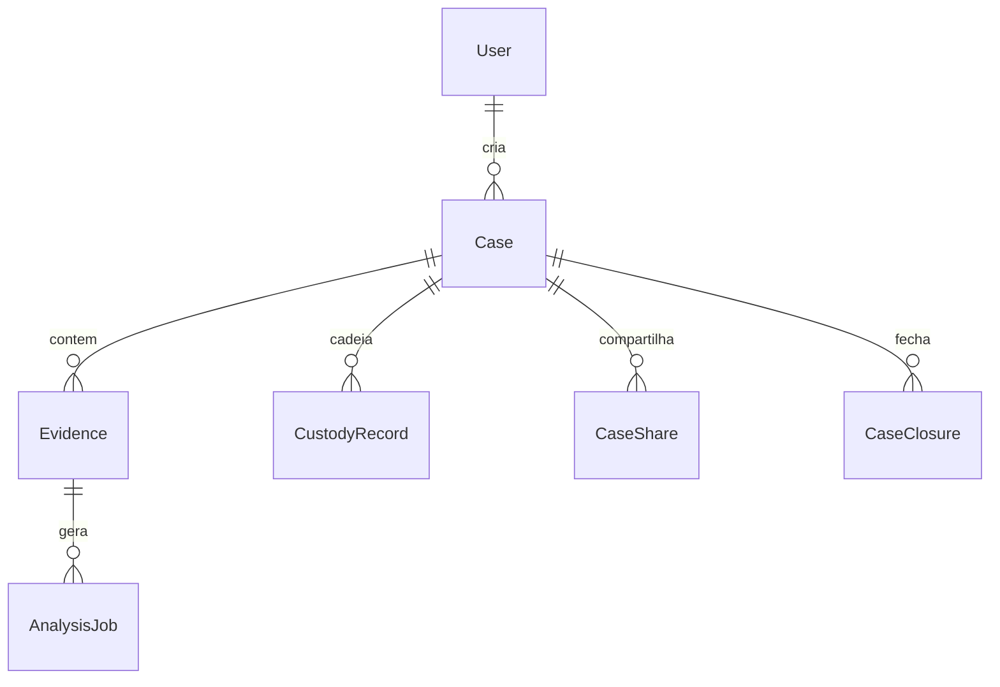

# 06 — Dados e integrações

## Visão dos stores

| Store | Conteúdo | Path / serviço |
|-------|----------|----------------|
| PostgreSQL | Metadados, jobs, custódia, shares, closures | Compose `db` / `DATABASE_URL` |
| Filesystem | Binários forenses | `data/uploads`, `results`, `derivatives`, `peritus_cases` |
| Redis | Filas Celery + lock GPU | broker (efêmero) |
| models/ | Pesos | montado no container |
| reference_data/ | Populações LR / typicality (calibração) | montado no container |

> Calibração **não** vive em YAMLs de protocolo sob `config/`. Ativos publicados ficam em `reference_data/`.

## Modelo mental de entidades



## Ciclo de vida dos arquivos

```text
Upload  → data/uploads + Evidence + custody evidence_upload
Job     → data/results/{case}/{evidence}/{job}/
Promote → data/derivatives + Evidence + custody derivative_saved
Peritus → ZIP legado → data/peritus_cases/{case_id}/ (workspace + binding)
VCP     → pacote .vcp.zip nativo (export/import entre instâncias ForensicAuth)
```

Soft-delete de caso/evidência **não** apaga a cadeia de custódia.

### Exclusão e derivados

Excluir uma evidência remove o arquivo do disco, marca `deleted_at`/`deleted_by` e grava `evidence_deleted`. **Derivados dela não caem por padrão** — são artefatos já custodiados, com proveniência autossuficiente no elo `derivative_saved`.

A cascata existe, mas é **opt-in** e restrita a derivados cujos insumos ativos estejam **todos** no escopo da exclusão (fecho transitivo em cadeias de derivação). Derivados que também dependem de insumo preservado permanecem e ganham a marca **"insumo excluído"** na aba Derivados.

| Endpoint | Uso |
|----------|-----|
| `POST /cases/{id}/evidences/deletion-preview` | Impacto antes de confirmar (dependentes, pacotes, retidos) |
| `POST /cases/{id}/evidences/delete` | Lote com `include_dependent_derivatives`; resultado por item |
| `DELETE /evidences/{id}` | Exclusão unitária (compatibilidade, sem cascata) |

O lote faz commit por item: falha isolada não desfaz elos já gravados e retorna em `failed` o que não saiu. `deletion_reason` (`user_request` ou `parent_deleted`) e `dependent_derivatives_deleted` ficam em `details` do elo.

### Rótulos de questionados

Evidências do caso (questionados) podem ser agrupadas por `extra_metadata.questioned_group_label` (campo distinto de `reference_group_label` das referências). No upload, o Form `group_label` é obrigatório; evidências antigas sem o campo aparecem como **"Sem rotulo"**. Alterações posteriores usam `PATCH /evidences/{id}/group-label` ou bulk `POST /cases/{id}/evidences/group-label` e geram elo `evidence_group_label_changed`.

**Peritus ≠ VCP.** São canais distintos (`peritus_bridge_service` vs `case_transfer_service`). O diretório `data/peritus_cases/` é o workspace do bridge legado do Peritus (cópia/extração do ZIP), não o destino do VCP.

## Migrações

- Alembic: `alembic/` + `alembic.ini`  
- Revision bootstrap: `alembic/versions/20260625_initial_schema.py`

## Integrações de produto

| Integração | Direção | Docs |
|------------|---------|------|
| **VCP** | export/import `.vcp.zip` entre instâncias VA | [`public/PACOTE-VERIFICATION-CASE-PACKAGE.md`](public/PACOTE-VERIFICATION-CASE-PACKAGE.md), spec 12 |
| **Peritus** | import/export ZIP+XML legado → `data/peritus_cases/` | `peritus_bridge_service` (+ `peritus_*`); guia contribuidor |
| **PRNU fingerprints** | API dedicada | endpoints `prnu` |
| **ICP-Brasil** no fechamento | planejado | stub HTTP 501 hoje |
| **Worker GPU remoto** | LAN + Redis/FS | [`deploy/WORKER-REMOTE.md`](deploy/WORKER-REMOTE.md) |

## Lineage de derivados

Spec [`specs/modules/14-module-derivation-lineage.md`](specs/modules/14-module-derivation-lineage.md).

## Segredos e sensibilidade

Evidências = material sensível. Backup: **DB + `data/` + chaves Ed25519 + `.env`**.

## Como verificar

```bash
ls data/uploads data/results data/derivatives reference_data
```

## Atenção

- Apagar só o banco deixa órfãos no disco (e vice-versa).  
- Exclusão remove o binário: sem backup não há recuperação, mesmo com o registro na cadeia preservado.  
- Worker remoto sem NFS/mesmo path quebra jobs.  
- `reference_data` incompleto → LR calibrado falha ou degrada.  
- Não confundir VCP com pacote Peritus: pacotes e endpoints não são intercambiáveis.

## Próximo

[07 — Operação e setup](07-operacao-e-setup.md)
