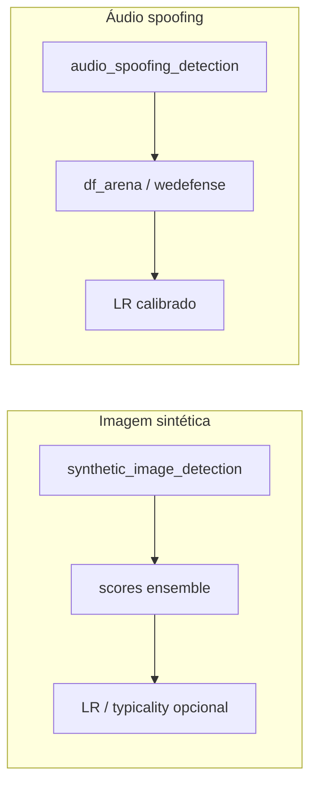

# 09 — ML e artefatos

## O que é

O ForensicAuth faz **inferência local** com pesos em `models/` e, para algumas técnicas, **calibração LR / typicality** com populações em **`reference_data/`**.

## Onde está

| Artefato | Path |
|----------|------|
| Checkpoints | `models/` (sepael, spoofing, IMDL/TruFor, …) |
| Catálogos LR | `reference_data/audio_spoofing/`, `reference_data/synthetic_image/` |
| Código 1P ML | `src/backend/forensics/*` |
| Código 3P | `vendor/*` |
| Adapters | `src/backend/core/plugins/*` |

## Pipelines principais

Fonte de verdade da fila GPU:
`src/backend/core/gpu_inference.py::ML_GPU_TECHNIQUES`.

| Grupo | IDs atuais na fila `gpu` |
|-------|---------------------------|
| Imagem / face | `synthetic_image_detection`, `safire`, `imdlbenco`, `presentation_attack_detection`, `moe_ffd` |
| Áudio | `audio_spoofing_detection` |
| Vídeo | `videofact`, `stil_video_detection`, `lowres_fake_video`, `truvil`, `vilocal` |

PRNU não está nesse conjunto e é despachado para CPU, apesar do hint
`gpu: true` no registry do frontend.

UI `reference_lr.mode`: `result_only` | `calibrated` (contrato no scaffold de técnicas).

Meta-classificador ensemble (imagem sintética, áudio spoofing e scaffolds `calibrated`):
treino único em `core.synthetic_lr_reference.train_meta_classifier`. No **logistic**,
features passam por **z-score (`StandardScaler`)** antes do LogReg para equalizar
escalas de logit entre detectores; XGBoost permanece sem scaler. Cache LR inclui
`feature_scale: zscore|none`.

## Vendor — política

- Código sob `vendor/` é **terceiro** ou fork; não reescrever.  
- Atualizar só com pin/teste e consciência de licença.  
- Ter vendor ≠ técnica ativa (standby).

Seis entradas (`MoE-FFD`, `bfree`, `dmimage_detection`,
`grip_clipbased_synthetic`, `sidbench`, `truebees_deepfake_detectors`) são
gitlinks no tree sem `.gitmodules`. Portanto, `git submodule update` não
reconstrói sozinho o ambiente. Registre URL, commit, licença e hash no
procedimento institucional antes de uso pericial.

Lista exemplificativa: `df_arena_1b`, `wedefense`, `SAFE`, `SAFIRE`,
`videofact`, `truvil`, `vilocal`.

## Warmup e papéis de processo

`app/worker_bootstrap.py`: carrega modelos pesados quando `FORENSICAUTH_PROCESS_ROLE=worker-gpu`. A API deve permanecer leve em VRAM.

## Como obter / verificar pesos

1. Identificar fonte oficial, licença, versão/commit e hash esperado.
2. Conferir árvore `models/<tecnica>/`.
3. Usar scripts existentes quando aplicável:
   `download_truvil_weights.py` e `download_vilocal_weights.py`.
4. Para MoE-FFD, obter `MoE-FFD.tar` da fonte oficial e colocá-lo em
   `models/moe_ffd/`; não há script versionado para esse download.
5. Executar capability probe e testes com marker `weights` / `gpu` (fora do
   default).
6. Guardar manifesto de versões/hashes junto ao procedimento de deploy.

Mensagens antigas de runtime podem sugerir scripts que não existem (por
exemplo, download MoE/IMDL). Consulte `scripts/README.md` antes de executar um
nome de script citado em erro.

Build pesado de referências: variável `FORENSICAUTH_REFERENCE_BUILD_DIR` (fora do git) — ver `reference_data/README.md`.
Ingestão publicada usa `scripts/ingest_synthetic_image_reference.py` e
`scripts/ingest_audio_spoofing_reference.py`; não existe
`scripts/reference_pipeline.py`.

## Variáveis

`MODELS_DIR`, paths de reference data na config, flags de disponibilidade por plugin (`is_runtime_available` quando existir).

## Papers / referências

[`references/papers/imdl/`](references/papers/imdl/README.md) e READMEs dentro de cada `vendor/*/`.

## Próximo

[10 — Testes e qualidade](10-testes-e-qualidade.md)
