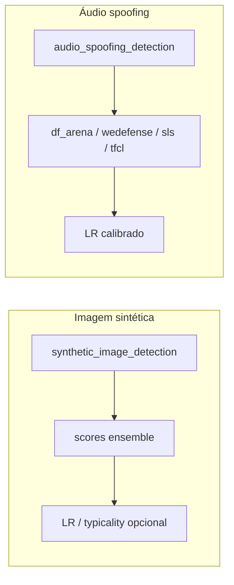

# 09 — ML e artefatos

## O que é

O ForensicAuth faz **inferência local** com pesos em `models/` e, para algumas técnicas, **calibração LR / typicality** com populações em **`reference_data/`**.

## Onde está

| Artefato | Path |
|----------|------|
| Checkpoints | `models/` (sepael, spoofing, IMDL/TruFor, …) |
| Catálogos LR | `reference_data/audio_spoofing/`, `reference_data/synthetic_image/` |
| Código 1P ML | `src/backend/forensics/*` |
| Código 3P | `vendor/*` |
| Adapters | `src/backend/core/plugins/*` |

## Pipelines principais

Todas acima (lista GPU) usam fila **`gpu`** — ver `core/gpu_inference.py`.

UI `reference_lr.mode`: `result_only` | `calibrated` (contrato no scaffold de técnicas).

Meta-classificador ensemble (imagem sintética, áudio spoofing e scaffolds `calibrated`):
treino único em `core.synthetic_lr_reference.train_meta_classifier`. No **logistic**,
features passam por **z-score (`StandardScaler`)** antes do LogReg para equalizar
escalas de logit entre detectores; XGBoost permanece sem scaler. Cache LR inclui
`feature_scale: zscore|none`.

## Vendor — política

- Código sob `vendor/` é **terceiro** ou fork; não reescrever.  
- Atualizar só com pin/teste e consciência de licença.  
- Ter vendor ≠ técnica ativa (standby).

Lista exemplificativa: `SAFE`, `SAFIRE-main`, `df_arena_1b`, `wedefense`, `sls_asvspoof`, `tfcl`, `MoE-FFD`, `videofact-wacv-2024`, `truebees_deepfake_detectors`, …

## Warmup e papéis de processo

`app/worker_bootstrap.py`: carrega modelos pesados quando `FORENSICAUTH_PROCESS_ROLE=worker-gpu`. A API deve permanecer leve em VRAM.

## Como obter / verificar pesos

1. Conferir árvore `models/<tecnica>/`.  
2. Submeter job → se falhar por missing weights, logs do worker.  
3. Testes com marker `weights` / `gpu` (não rodam no default).  
4. Guia contribuidores: [`developer/02-guia-contribuidor.md`](developer/02-guia-contribuidor.md).

Build pesado de referências: variável `FORENSICAUTH_REFERENCE_BUILD_DIR` (fora do git) — ver `reference_data/README.md`.

## Variáveis

`MODELS_DIR`, paths de reference data na config, flags de disponibilidade por plugin (`is_runtime_available` quando existir).

## Armadilhas

| Armadilha | Efeito |
|-----------|--------|
| Pesos só na máquina da API | Worker não acha checkpoint |
| Typicality com leak de split | Métricas otimistas demais |
| Meta logistic sem z-score / LogReg cru | Detector de maior escala domina o ensemble |
| Rodar vários workers GPU `-c N` | OOM / corrupção de contexto |
| Alterar vendor “só um pouquinho” | Quebra equivalência forense |

## Papers / referências

[`references/papers/imdl/`](references/papers/imdl/README.md) e READMEs dentro de cada `vendor/*/`.

## Próximo

[10 — Testes e qualidade](10-testes-e-qualidade.md)
