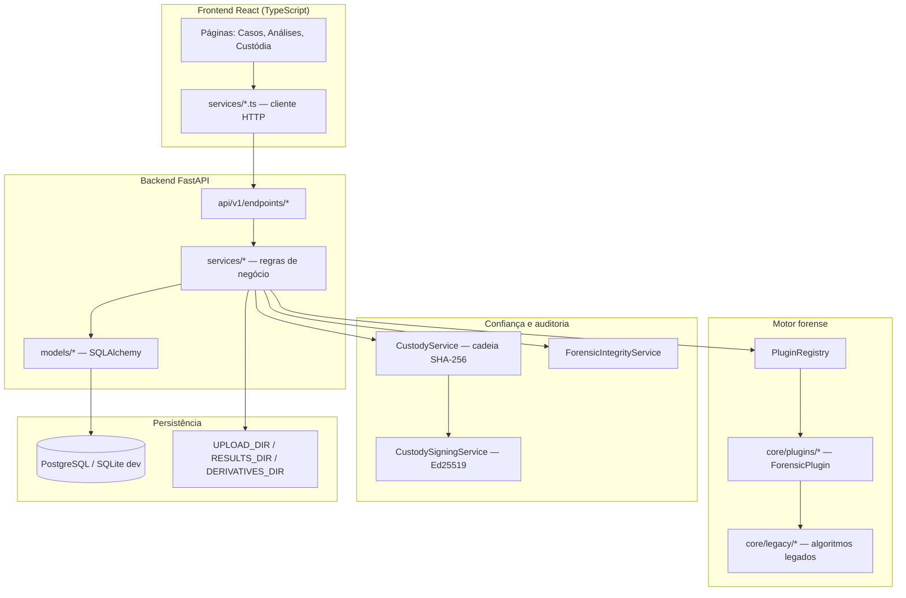
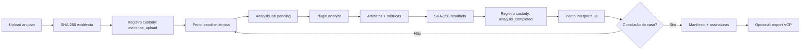
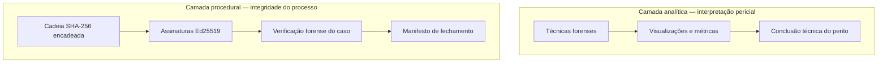

# ForensicAuth — Visão geral (blocos funcionais)

Plataforma forense web para organizar **casos**, submeter **evidências**, executar **técnicas de autenticidade** (imagem, áudio, vídeo, PDF), manter **cadeia de custódia** rastreável e **fechar/exportar** casos com integridade criptográfica.

---

## 1. Jornada do usuário final (perito)

O perito não interage com “módulos de código”; interage com **casos** e **evidências**. A tabela abaixo liga cada tarefa à intenção forense e ao bloco do sistema.

| # | Tarefa do usuário | Objetivo forense | Onde na UI | Bloco backend principal |
|---|-------------------|------------------|------------|-------------------------|
| 1 | Login | Identificar quem executa cada ação | `/login` | `auth_service`, JWT |
| 2 | Criar caso | Agrupar evidências sob protocolo | Casos → Novo caso | `cases` API, `Case` |
| 3 | Upload de evidência | Preservar bytes originais + hash | Detalhe do caso → Evidências | `evidence_service`, `CustodyService` |
| 4 | Escolher técnica e analisar | Detectar adulteração / inconsistência | Aba Análises → página da técnica | `JobService` + **plugin forense** |
| 5 | Ver resultados | Interpretar mapas, gráficos, relatórios | Página da análise / derivados | `analysis` API, disco `RESULTS_DIR` |
| 6 | Salvar derivados | Manter versões derivadas rastreáveis | Derivados / referências | `derivative_service`, custódia |
| 7 | Verificar cadeia | Confirmar integridade e assinaturas | Aba Custódia | `custody_service`, `forensic_integrity_service` |
| 8 | Compartilhar caso | Colaboração controlada | Painel compartilhar | `case_share_service` |
| 9 | Fechar / assinar caso | Manifesto forense imutável | Fechar caso / assinar | `case_lifecycle_service`, Ed25519 |
| 10 | Exportar VCP | Transferir caso para outra instância (Verification Case Package) | Exportar VCP | `case_transfer_service` |
| 11 | Importar VCP | Restaurar caso com validação (Verification Case Package) | Casos → Importar / drag-drop | `case_transfer_service` |
| 12 | Gerar laudo (quando disponível) | PDF probatório | Relatórios | módulo reports (spec 10) |

---

## 2. Diagrama de blocos do sistema

---

## 3. Fluxo principal: da evidência à conclusão de autenticidade

Este é o caminho mais importante para entender **como o código apoia a verificação de autenticidade**.

**Princípio:** cada transformação relevante deixa um elo na cadeia com hashes de entrada/saída e parâmetros canônicos, assinados pelo sistema (Ed25519).

---

## 4. Os sete blocos funcionais

### Bloco A — Identidade e acesso

- **Função:** Quem pode criar casos, analisar, administrar usuários.
- **Perfis:** `admin`, `perito`, `analista` (analista não cria casos).
- **Código:** `services/auth_service.py`, `services/case_access.py`, `api/v1/endpoints/auth.py`, frontend `store/authStore.ts`, `ProtectedRoute.tsx`.

### Bloco B — Gestão de casos e evidências

- **Função:** Container organizacional; arquivos binários no disco; metadados no banco.
- **Código:** `Case`, `Evidence`, `evidence_service.py`, `CaseDetail.tsx`, `Cases.tsx`.
- **Regra:** RN-01 — hash antes de qualquer processamento.

### Bloco C — Motor de análise (plugins)

- **Função:** Executar técnicas forenses sem acoplar a UI ao algoritmo.
- **Contrato:** `ForensicPlugin` (`core/forensic_plugin.py`) — `name`, `supported_types`, `analyze()`, `validate_parameters()`.
- **Descoberta:** `PluginRegistry` carrega `core/plugins/*.py` no startup do `JobService`.
- **Legado:** algoritmos sensíveis ficam em `core/legacy/`; plugins apenas orquestram (ver AGENTS.md regra 8).

### Bloco D — Jobs e execução

- **Função:** Submeter, acompanhar progresso, persistir resultados.
- **Código:** `JobService`, `AnalysisJob`, `api/v1/endpoints/analysis.py`, hook frontend `useForensicJob.ts`.
- **Estados:** `pending` → `running` → `completed` | `failed`.
- **Nota:** arquitetura prevê Celery/Redis; em dev muitos jobs rodam de forma síncrona via API/worker local.

### Bloco E — Cadeia de custódia

- **Função:** Log append-only encadeado por SHA-256 + assinatura Ed25519 por elo.
- **Código:** `custody_service.py`, `custody_signing_service.py`, `CustodyPanel.tsx`.
- **Tipos de registro (exemplos):** `evidence_upload`, `analysis_completed`, `derivative_saved`, `case_shared`, `case_closed`, `case_deleted`, `case_imported`.
- **Imutabilidade:** updates bloqueados (trigger SQLite em dev; política equivalente em PG).

### Bloco F — Ciclo de vida e colaboração

- **Função:** Compartilhar casos; fechamento bilateral com manifesto assinado; reabertura.
- **Código:** `case_share_service.py`, `case_lifecycle_service.py`, `CaseSharePanel.tsx`.
- **Status:** `aberto`, `fechamento_pendente`, `fechado`.

### Bloco G — Transferência entre instâncias (Verification Case Package / VCP)

- **Função:** Pacote ZIP portável (VCP) com arquivos + cadeia + chave pública; validação antes de gravar.
- **Código:** `case_transfer_service.py`, modais `CaseImportVcpModal`, `CaseExportVcpModal`.
- **Spec:** [`docs/specs/modules/12-module-case-transfer.md`](../specs/modules/12-module-case-transfer.md).

---

## 5. Técnicas por tipo de mídia (mapa rápido)

Relação entre **tipo de evidência** e **técnicas** expostas na UI (slug → plugin).

### Imagem (`file_type: imagem`)

| UI / rota | Plugin (`name`) | Foco de autenticidade |
|-----------|-----------------|------------------------|
| ELA | `ela` | Compressão JPEG / regiões editadas |
| Metadados JPEG | `metadata` | EXIF, estrutura JPEG, quantização |
| DCT Quantization | `dct_quantization` | Tabelas de quantização / recompressão |
| Reamostragem | `resampling` | Interpolação / redimensionamento |
| PatchMatch | `patchmatch` | Cópia-mover (clone) |
| Dupla compressão | `double_compression` | JPEG duplamente comprimido |
| BAG | `bag_extraction` | Grade de blocos 8×8 |
| JPEG Ghosts | `jpeg_ghosts` | Fantasmas de qualidade JPEG |
| ZERO | `zero_grid` | Grade JPEG (libzero) |
| PRNU | `prnu` | Ruído de sensor / câmera |

Plugins registrados mas ocultos na UI: `hash_compare`, `synthetic_image_detection`, `deepfake`, etc. (podem ser expostos futuramente).

### Áudio (`file_type: audio`)

| UI | Plugin | Foco |
|----|--------|------|
| Hub Áudio forense | `audio_spectrogram`, `audio_enf`, `audio_ltas`, `audio_levels`, `audio_dc_local` | Espectro, ENF, níveis, conteúdo DC |
| (API) | `mp3_parser`, `opus_parser`, `wav_ima_adpcm` | Estrutura de containers/codecs |

### Vídeo (`file_type: video`)

| UI | Plugin | Foco |
|----|--------|------|
| Parser ISO BMFF | `isomedia_parser` | Árvore de atoms, metadados |
| Similaridade ISO BMFF | `isomedia_compare` | Comparação estrutural entre vídeos |

### PDF (`file_type: pdf`)

| UI | Plugin | Foco |
|----|--------|------|
| Overlay por fonte | `pdf_font_color_overlay` | Camadas de texto/fonte |
| Estrutura (grafo) | `pdf_structure_metrics` | Métricas do grafo PDF |
| Similaridade estrutural | `pdf_structure_similarity` | Comparação entre PDFs |
| Extração forense | `pdf_forensic_extract` | Incremental updates, metadados |

---

## 6. Verificação de autenticidade: duas camadas

- **Analítica:** responde “há indícios de adulteração neste arquivo?” (ELA, PRNU, etc.).
- **Procedural:** responde “este histórico de ações e arquivos foi alterado desde o registro?” (custódia, VCP, fechamento).

Ambas são necessárias em contexto probatório: a técnica gera **indícios**; a custódia garante **rastreabilidade**.

---

## 7. Onde cada spec modular se encaixa

| Spec | Bloco |
|------|-------|
| `02-module-auth` | A |
| `03-module-core` | C (ForensicPlugin) |
| `04-module-custody` | E |
| `05-module-jobs` | D |
| `06-module-image` … `09-module-pdf` | C (por mídia) |
| `10-module-reports` | Laudos |
| `11-module-case-sharing-lifecycle` | F |
| `12-module-case-transfer` | G |

---

## 8. Próximo passo

Para **navegar o código**, abrir [`02-guia-contribuidor.md`](02-guia-contribuidor.md): estrutura de diretórios, checklist para nova técnica, convenções de teste e arquivos-chave indexados.
