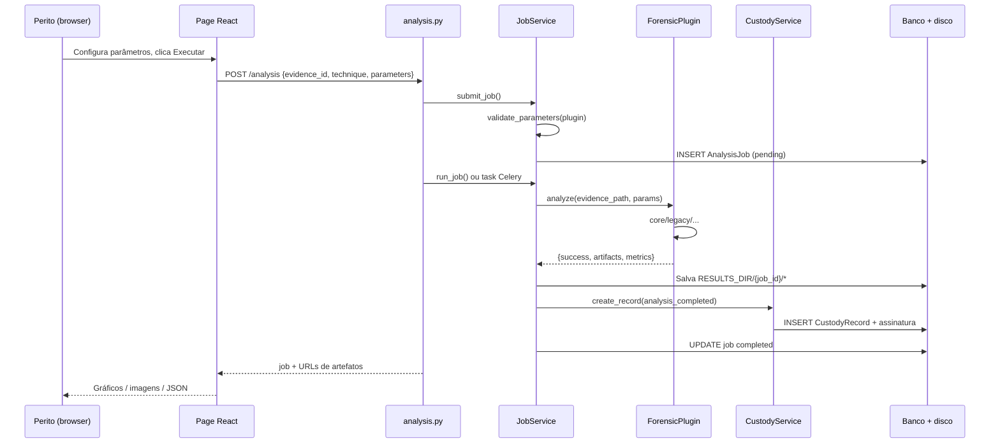
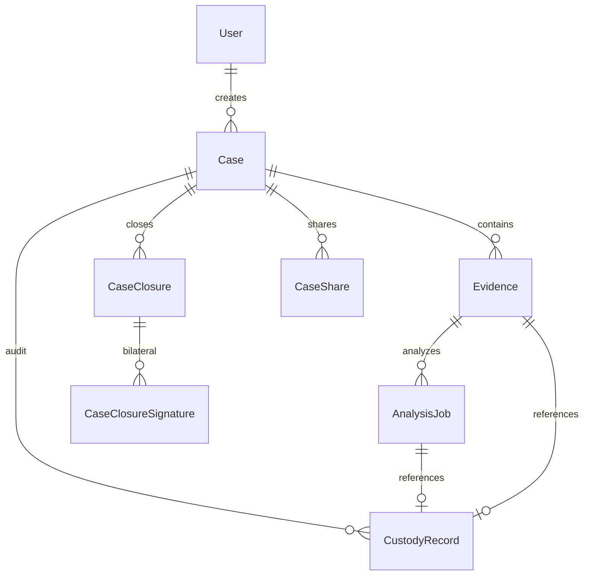
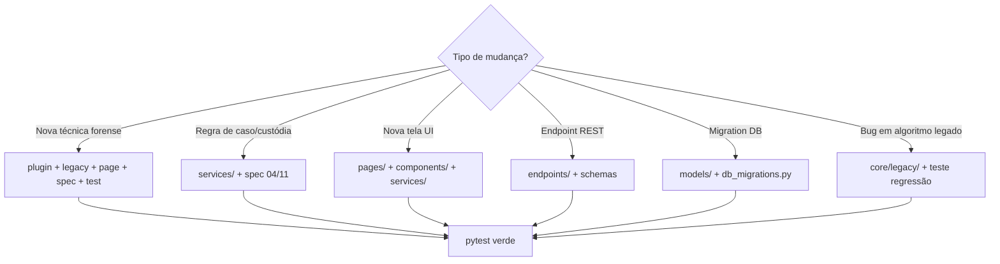

# Guia do contribuidor — ForensicAuth

Documento **detalhado** para quem vai modificar ou estender o código. Complementa a [visão geral](01-visao-geral.md) e as specs em `docs/specs/`.

---

## 1. Estrutura do repositório

```
ForensicAuth/
├── AGENTS.md                 # Regras máximas (ler primeiro)
├── docs/
│   ├── specs/                # Especificações formais (SDD)
│   └── developer/            # Esta documentação
├── prompts/                  # Prompts de execução por módulo
├── tests/
│   ├── unit/                 # Testes Python (pytest)
│   └── specs/                # Especificações de teste (TDD)
├── src/
│   ├── backend/
│   │   ├── app/              # FastAPI, config, DB, migrations
│   │   ├── api/v1/endpoints/ # Rotas HTTP (finas)
│   │   ├── models/           # Entidades SQLAlchemy
│   │   ├── services/         # Lógica de negócio
│   │   ├── core/
│   │   │   ├── forensic_plugin.py
│   │   │   ├── plugin_registry.py
│   │   │   ├── plugins/      # Adaptadores ForensicPlugin (1 por técnica)
│   │   │   └── legacy/       # Algoritmos legados (NÃO reescrever)
│   │   └── tools/            # Scripts CLI (diag, repair)
│   └── frontend/
│       └── src/
│           ├── pages/        # Telas (1+ por técnica dedicada)
│           ├── components/   # UI reutilizável
│           ├── services/     # Cliente API (axios)
│           ├── hooks/        # useForensicJob, etc.
│           └── utils/        # caseAnalysisNav, rotas de análise
└── Legados/                  # Notebooks/código histórico (referência)
```

**Convenção de camadas**

| Camada | Responsabilidade | Não deve |
|--------|------------------|----------|
| `endpoints/` | HTTP, auth, validação de entrada, status codes | Regra de negócio pesada |
| `services/` | Orquestração, custódia, permissões | Conhecer React |
| `core/plugins/` | I/O padronizado para técnicas | SQL direto |
| `core/legacy/` | Algoritmo forense original | Depender de FastAPI |

---

## 2. Fluxo de uma requisição de análise

Diagrama de sequência simplificado (execução síncrona; com Celery, o passo 6 roda no worker).



**Arquivos a abrir ao debugar uma análise**

1. Frontend: `pages/*Analysis.tsx` ou `hooks/useForensicJob.ts`
2. API: `api/v1/endpoints/analysis.py`
3. Orquestração: `services/job_service.py` → `submit_job`, `run_job`
4. Técnica: `core/plugins/<tecnica>_plugin.py`
5. Legado: `core/legacy/<dominio>/`

---

## 3. Modelo de dados (relações úteis)



**Campos críticos para autenticidade**

| Entidade | Campo | Uso |
|----------|-------|-----|
| `Evidence` | `sha256` | Integridade do arquivo original |
| `AnalysisJob` | `parameters`, `result_sha256` | Reprodutibilidade |
| `CustodyRecord` | `record_hash`, `previous_record_hash`, `system_signature` | Cadeia + non-repúdio |
| `CaseClosure` | `manifest_sha256`, `manifest_json` | Snapshot do caso ao fechar |

---

## 4. Como funciona um plugin forense

### Contrato (`core/forensic_plugin.py`)

```python
class ForensicPlugin(ABC):
    @property
    def name(self) -> str: ...           # ex: "ela"
    @property
    def supported_types(self) -> list[str]: ...  # ex: ["imagem"]

    def validate_parameters(self, parameters) -> tuple[bool, str]: ...
    def analyze(self, evidence_path: str, parameters) -> dict: ...
```

### Retorno esperado de `analyze()`

```python
{
    "success": True,
    "artifacts": [...],   # paths temporários; JobService copia para RESULTS_DIR
    "metrics": {...},     # números expostos na API
    "logs": [...],
    # chaves específicas mapeadas em job_service (heatmap_path, etc.)
}
```

O `JobService.run_job` copia dezenas de chaves conhecidas (`heatmap_path`, `spectrogram_png_path`, …) para `{RESULTS_DIR}/{job_id}/`. Ao adicionar artefato novo, **registrar a chave** em `job_service.py` na lista `artifact_mappings`.

### Registro automático

`PluginRegistry.discover_and_register("core/plugins")` importa cada `*.py`, instancia classes que herdam `ForensicPlugin` e indexa por `instance.name`.

---

## 5. Checklist: adicionar uma nova técnica forense

### Backend

1. **Spec:** criar/atualizar `docs/specs/modules/0X-module-*.md` e `tests/specs/test-module-*.md`
2. **Legado (se aplicável):** portar algoritmo para `core/legacy/<area>/` sem alterar lógica (AGENTS.md §8)
3. **Plugin:** `core/plugins/minha_tecnica_plugin.py` implementando `ForensicPlugin`
4. **Runtime:** se depende de binário/GPU, estender `core/technique_runtime.py`
5. **JobService:** mapear parâmetros especiais (ex.: `reference_evidence_id` → path) se necessário
6. **Testes:** `tests/unit/test_minha_tecnica.py` + regressão contra notebook legado se existir

### Frontend

1. **Rota:** registrar em `App.tsx` → `/cases/:caseId/analysis/<slug>`
2. **Meta:** adicionar entrada em `utils/caseAnalysisNav.ts` (`ANALYSIS_ROUTE_META`)
3. **Página:** criar `pages/MinhaTecnicaAnalysis.tsx` (usar `AnalysisPageShell`, `useForensicJob`)
4. **Painel do caso:** `CaseAnalysisPanels.tsx` lista técnicas via API `/analysis/techniques`

### Custódia

- Normalmente **automático:** `JobService` chama `CustodyService.create_record` após sucesso.
- Se a técnica gera **derivado persistido** como evidência, usar `derivative_service` + registro `derivative_saved`.

---

## 6. Frontend: padrões importantes

### Cliente HTTP

- `services/api.ts` — axios + JWT em `localStorage`
- Domínios: `cases.ts`, `evidence.ts`, `analysis.ts`, `audit.ts`, `caseShares.ts`

### Página de análise típica

```tsx
// Padrão: useForensicJob(caseId, "ela", evidenceId)
// - submit → poll status → carrega artefatos de GET /analysis/{id}/result
```

Arquivos de referência:

- Simples: `pages/ELAAnalysis.tsx`
- Comparativo: `pages/PDFStructureSimilarityAnalysis.tsx`
- Hub multi-técnica: `pages/AudioForensicsHub.tsx`

### Detalhe do caso (`CaseDetail.tsx`)

Abas: **Evidências** | **Análises** | **Derivados** | **Custódia**

- Análises delega a `CaseAnalysisPanels` (cards por mídia)
- Custódia: `CustodyPanel` — verificar cadeia, relatório narrativo, verificação forense

---

## 7. Serviços backend (índice)

| Serviço | Arquivo | Responsabilidade |
|---------|---------|------------------|
| Autenticação | `auth_service.py` | Login, JWT, bcrypt |
| Casos | endpoints `cases.py` + `case_access.py` | CRUD, permissões, listagem |
| Evidências | `evidence_service.py` | Upload, hash, classificação MIME |
| Jobs | `job_service.py` | Submit/run, plugins, artefatos |
| Custódia | `custody_service.py` | Cadeia SHA-256, verify_chain |
| Assinatura | `custody_signing_service.py` | Ed25519 por elo |
| Integridade | `forensic_integrity_service.py` | Verificação ampliada do caso |
| Derivados | `derivative_service.py` | Linhagem de arquivos derivados |
| Compartilhamento | `case_share_service.py` | ACL por caso |
| Ciclo de vida | `case_lifecycle_service.py` | Fechar, assinar, manifesto |
| Transferência | `case_transfer_service.py` | Export/import Verification Case Package (VCP) |
| Exclusão | `case_deletion_service.py` | Soft-delete + tombstone |
| Relatório narrativo | `custody_narrative_report.py` | HTML/MD da cadeia |
| PRNU | `prnu_fingerprint_service.py` | Fingerprints de sensor |

---

## 8. API REST (mapa rápido)

Prefixo comum: `/api/v1`

| Tag | Prefixo / rotas | Serviço |
|-----|-----------------|---------|
| auth | `/auth/login`, `/auth/me` | auth |
| cases | `/cases`, `/cases/{id}/close`, `/export` | cases, lifecycle, transfer |
| evidences | `/evidence`, upload multipart | evidence |
| analysis | `/analysis`, `/analysis/techniques` | job |
| audit | `/audit`, `/audit/case/{id}/...` | custody, integrity |
| case-shares | `/cases/{id}/shares` | share |
| case-transfer | `/cases/import`, `/cases/import/validate` | transfer |
| prnu | `/prnu/fingerprints` | prnu |
| users | `/users` | user (admin) |

Rotas finas: validar entrada → chamar service → schema Pydantic de resposta.

---

## 9. Cadeia de custódia (detalhe para contribuidores)

### Criação de elo

`CustodyService.create_record(...)`:

1. Calcula `record_hash` = SHA-256(JSON canônico dos campos do registro + elo anterior)
2. Assina `record_hash` com Ed25519 (`CustodySigningService`)
3. INSERT em `custody_records` (append-only)

### Imutabilidade

- **Produção:** política no banco (sem UPDATE/DELETE em `custody_records`)
- **SQLite dev:** trigger `trg_custody_immutable` bloqueia UPDATE
- Exceções controladas: `_allow_custody_record_updates` (re-assinatura administrativa, import VCP)

### Verificações expostas na UI

| Ação UI | Endpoint / serviço |
|---------|-------------------|
| Verificar cadeia | `CustodyService.verify_chain` |
| Verificação forense | `ForensicIntegrityService.verify_case_forensic_integrity` |
| Relatório narrativo | `custody_narrative_report.py` |

---

## 10. Transferência Verification Case Package (VCP) — resumo técnico

```
.vcp.zip
├── package.json              # manifesto de hashes
├── crypto/public_key.pem     # Ed25519 exportador
├── case/*.json               # metadados + cadeia + fechamentos
└── files/{sha256}            # binários
```

Importação: `validate_package` (dry-run) → conflitos (caso ativo vs tombstone) → `import_case` → registro `case_imported`.

Ver spec completa: [`12-module-case-transfer.md`](../specs/modules/12-module-case-transfer.md).

---

## 11. Testes

```bash
conda activate forensicauth
cd src/backend
python -m pytest ../../tests/unit/ -q
```

| Tipo | Onde | Quando escrever |
|------|------|-----------------|
| Unitário serviço | `tests/unit/test_*.py` | Toda regra de negócio nova |
| Plugin / legado | regressão vs notebook | Alteração em `core/legacy/` |
| Frontend | `*.test.ts`, Vitest | stores, utils críticos |
| E2E | Playwright (frontend) | fluxos UI completos |

**Fixtures:** `tests/conftest.py` — `db_session`, `sample_case`, `test_user`, `sample_evidence`.

Antes de merge: testes verdes (AGENTS.md regra 4).

---

## 12. Configuração e diretórios de disco

Variáveis em `app/config.py` / `.env`:

| Variável | Uso |
|----------|-----|
| `DATABASE_URL` | SQLite dev ou PostgreSQL |
| `UPLOAD_DIR` | Evidências originais `{case_id}/` |
| `RESULTS_DIR` | Saída de jobs `{job_id}/` |
| `DERIVATIVES_DIR` | Derivados `{case_id}/` |
| `SECRET_KEY` | JWT |
| `CUSTODY_SIGNING_PRIVATE_KEY` | Ed25519 produção |

Chave dev persistente: `src/backend/.data/custody_ed25519_dev.key`

---

## 13. Código legado protegido

**Não substituir** sem teste de equivalência exata (AGENTS.md §8):

- `jpegio`, `libzero.so_`, parsers MP3/Ogg/ISO BMFF
- PyMuPDF + tokenizador PDF
- PRNU (wavelet db4), PatchMatch (Zernike + Numba)
- Modelos Detecção de imagens sintéticas / deepfake

Padrão correto: **adapter** em `core/plugins/` chama **legado** em `core/legacy/`.

---

## 14. Diagrama: onde implementar cada tipo de mudança



---

## 15. Comandos úteis no dia a dia

```bash
# Backend (dev)
conda activate forensicauth
cd src/backend
uvicorn app.main:app --reload --port 8000

# Frontend (dev)
cd src/frontend
npm run dev

# Testes de um módulo
python -m pytest ../../tests/unit/test_case_transfer.py -q

# Diagnóstico custódia
python tools/diag_custody.py

# Reparar assinaturas (admin)
python tools/repair_custody_signatures.py --dry-run
```

---

## 16. Leitura obrigatória antes do primeiro PR

1. [`AGENTS.md`](../../AGENTS.md)
2. [`docs/specs/00-overview.md`](../specs/00-overview.md)
3. Spec do módulo que você toca (`docs/specs/modules/`)
4. [`01-visao-geral.md`](01-visao-geral.md) — contexto funcional
5. Test spec correspondente em `tests/specs/`

Dúvidas sobre **comportamento esperado** → spec, não o código.  
Dúvidas sobre **onde colocar código** → este guia + estrutura de pastas existente.

---

## 17. Glossário

| Termo | Significado |
|-------|-------------|
| **Evidência** | Arquivo binário submetido ao caso (imagem, áudio, vídeo, PDF) |
| **Job / AnalysisJob** | Execução de uma técnica sobre uma evidência |
| **Plugin** | Adaptador que implementa `ForensicPlugin` |
| **Derivado** | Arquivo gerado a partir de evidência/job, rastreado na custódia |
| **Cadeia de custódia** | Sequência imutável de registros hash-encadeados |
| **VCP** | Verification Case Package — ZIP de transferência entre instâncias |
| **Tombstone** | Caso soft-deleted mantido no DB para auditoria |
| **Manifesto** | JSON canonicalizado do estado do caso no fechamento |
