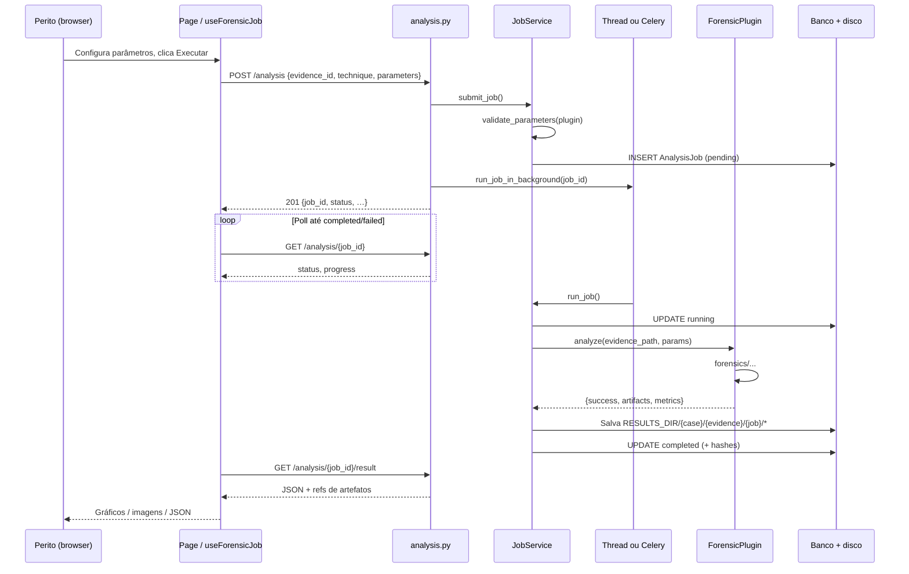
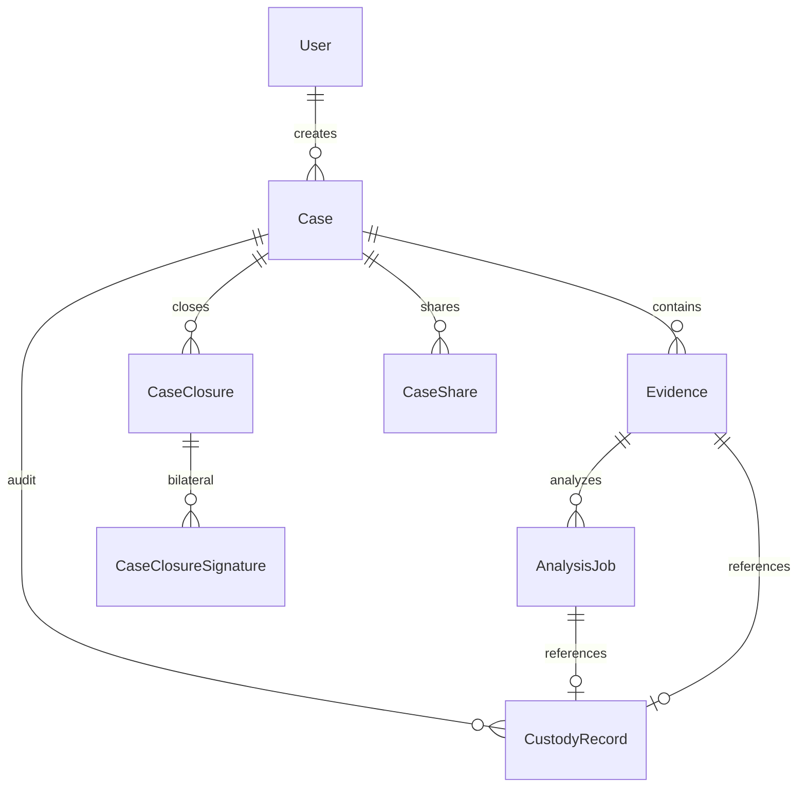
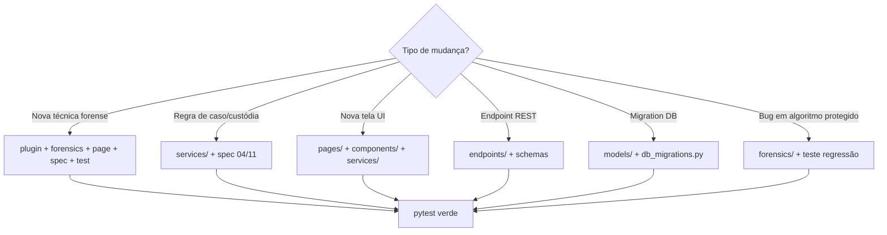

# Guia ForensicAuth

Documento **detalhado** para quem vai modificar ou estender o código. Complementa a [visão geral](01-visao-geral.md) e as specs em `docs/specs/`.

---

## 1. Estrutura do repositório

```
ForensicAuth/
├── docs/
│   ├── specs/                # Especificações formais (SDD)
│   └── developer/            # Esta documentação
├── tests/
│   ├── unit/                 # Testes Python (pytest)
│   └── specs/                # Especificações de teste (TDD)
├── src/
│   ├── backend/
│   │   ├── app/              # FastAPI, config, DB, migrations
│   │   ├── api/v1/endpoints/ # Rotas HTTP (finas)
│   │   ├── models/           # Entidades SQLAlchemy
│   │   ├── services/         # Lógica de negócio
│   │   ├── core/
│   │   │   ├── forensic_plugin.py
│   │   │   ├── plugin_registry.py
│   │   │   └── plugins/      # ForensicPlugin: *_plugin.py ou *_adapter.py (mesmo papel)
│   │   ├── forensics/        # Algoritmos forenses (NÃO reescrever sem equivalência)
│   │   └── tools/            # Scripts CLI (diag, repair)
│   └── frontend/
│       └── src/
│           ├── pages/        # Telas (1+ por técnica dedicada)
│           ├── components/   # UI reutilizável
│           ├── services/     # Cliente API (axios)
│           ├── hooks/        # useForensicJob, etc.
│           └── utils/        # caseAnalysisNav, rotas de análise
├── vendor/                   # Terceiros (não reescrever)
├── models/                   # Pesos ML
├── reference_data/           # Catálogos LR / typicality
└── data/                     # Runtime (uploads, results, …)
```

**Convenção de camadas**

| Camada | Responsabilidade | Não deve |
|--------|------------------|----------|
| `endpoints/` | HTTP, auth, validação de entrada, status codes | Regra de negócio pesada |
| `services/` | Orquestração, custódia, permissões | Conhecer React |
| `core/plugins/` | I/O padronizado para técnicas | SQL direto |
| `forensics/` | Algoritmo forense original | Depender de FastAPI |

### Mapa mental do backend 
#### Plugin = adapter

Arquivos em `core/plugins/` podem se chamar `*_plugin.py` ou `*_adapter.py`. **É o mesmo papel:** classe que herda `ForensicPlugin`, valida parâmetros e chama `forensics/`. Prefira `*_plugin.py` em código novo; não renomeie adapters existentes sem necessidade.

#### Onde fica cada `reference_data`

| Onde | Para quê |
|------|----------|
| `reference_data/` (raiz do repo) | Catálogos **publicados** de LR / typicality (runtime; `REFERENCE_DATA_DIR`) |
| `core/reference_data/` | Código de paths/loader que aponta para a raiz acima |
| `core/references/` | Outro domínio: PDFs de papers (ex. IMDL), **não** calibração LR |
| `core/*_lr_reference.py` | Lógica de score/LR em cima dos catálogos publicados |
| `src/backend/reference_data/cache/` | Cache local de runtime (não é a fonte canônica dos CSV) |

Calibração offline / bases pesadas ficam fora do happy path de produto (ver comentários em `core/reference_data/paths.py`).

#### Jobs: `job_service` × `job_runner` × Celery

| Peça | Arquivo | Função |
|------|---------|--------|
| **JobService** | `services/job_service.py` | Cadastrar job (`submit_job`), executar técnica (`run_job`), gravar artefatos/hashes |
| **job_runner** | `services/job_runner.py` | Enfileirar sem bloquear o HTTP (`run_job_in_background`) |
| **Celery** | `tasks/analysis_tasks.py` + Redis | Em produção Docker: worker consome a fila e chama `JobService.run_job` |
| **Thread local** | mesmo `job_runner` | Fallback em dev/SQLite quando Celery não está no caminho |

Fluxo curto: API → `submit_job` → `run_job_in_background` → (Celery ou thread) → `run_job` → plugin.

#### Peritus × VCP

| Canal | Serviço | Em uma frase |
|-------|---------|--------------|
| **VCP** | `case_transfer_service.py` | ZIP nativo ForensicAuth (caso + cadeia + chave) entre instâncias do produto |
| **Peritus** | `peritus_bridge_service.py` (+ `peritus_*`) | Import/export do formato legado Peritus (ZIP/XML), com materialização no VA |

São canais **diferentes**; não misturar pacotes nem endpoints.

#### Três sentidos de “models” (atalho)

| Path | Significado |
|------|-------------|
| `src/backend/models/` | ORM SQLAlchemy (`Case`, `Evidence`, …) |
| `models/` (raiz) | Pesos ML / checkpoints (`MODELS_DIR`) |
| `vendor/` | Código de terceiros (não reescrever) |

---

## 2. Fluxo de uma requisição de análise

Diagrama de sequência simplificado: o `POST` retorna na hora; a execução roda em background (thread local em dev/SQLite ou Celery). O frontend faz poll até `completed`/`failed`.


```mermaid
sequenceDiagram
  participant U as Perito (browser)
  participant P as Page / useForensicJob
  participant API as analysis.py
  participant JS as JobService
  participant BG as Thread ou Celery
  participant PL as ForensicPlugin
  participant DB as Banco + disco

  U->>P: Configura parâmetros, clica Executar
  P->>API: POST /analysis {evidence_id, technique, parameters}
  API->>JS: submit_job()
  JS->>JS: validate_parameters(plugin)
  JS->>DB: INSERT AnalysisJob (pending)
  API->>BG: run_job_in_background(job_id)
  API-->>P: 201 {job_id, status, …}
  loop Poll até completed/failed
    P->>API: GET /analysis/{job_id}
    API-->>P: status, progress
  end
  BG->>JS: run_job()
  JS->>DB: UPDATE running
  JS->>PL: analyze(evidence_path, params)
  PL->>PL: forensics/...
  PL-->>JS: {success, artifacts, metrics}
  JS->>DB: Salva RESULTS_DIR/{case}/{evidence}/{job}/*
  JS->>DB: UPDATE completed (+ hashes)
  P->>API: GET /analysis/{job_id}/result
  API-->>P: JSON + refs de artefatos
  P-->>U: Gráficos / imagens / JSON
```

> Custódia oficial entra ao **promover derivado** ou em eventos de lifecycle (share/close/import) — não automaticamente ao completar o job. Não há módulo de laudo PDF.

**Arquivos a abrir ao debugar uma análise**

1. Frontend: `pages/*Analysis.tsx` ou `hooks/useForensicJob.ts`
2. API: `api/v1/endpoints/analysis.py`
3. Dispatch: `services/job_runner.py` → `run_job_in_background`
4. Orquestração: `services/job_service.py` → `submit_job`, `run_job`
5. Técnica: `core/plugins/<tecnica>_plugin.py` ou `*_adapter.py`
6. Legado: `forensics/<dominio>/`

---

## 3. Modelo de dados (relações úteis)


```mermaid
erDiagram
  User ||--o{ Case : creates
  Case ||--o{ Evidence : contains
  Case ||--o{ CustodyRecord : audit
  Case ||--o{ CaseClosure : closes
  Case ||--o{ CaseShare : shares
  Evidence ||--o{ AnalysisJob : analyzes
  AnalysisJob ||--o| CustodyRecord : references
  Evidence ||--o| CustodyRecord : references
  CaseClosure ||--o{ CaseClosureSignature : bilateral
```

**Campos críticos para autenticidade**

| Entidade | Campo | Uso |
|----------|-------|-----|
| `Evidence` | `sha256` | Integridade do arquivo original |
| `AnalysisJob` | `parameters`, `result_sha256` | Reprodutibilidade |
| `CustodyRecord` | `record_hash`, `previous_record_hash`, `system_signature` | Cadeia + non-repúdio |
| `CaseClosure` | `manifest_sha256`, `manifest_json` | Snapshot do caso ao fechar |

---

## 4. Como funciona um plugin forense

### Contrato (`core/forensic_plugin.py`)

```python
class ForensicPlugin(ABC):
    @property
    def name(self) -> str: ...           # ex: "ela"
    @property
    def supported_types(self) -> list[str]: ...  # ex: ["imagem"]

    def validate_parameters(self, parameters) -> tuple[bool, str]: ...
    def analyze(self, evidence_path: str, parameters) -> dict: ...
```

### Retorno esperado de `analyze()`

```python
{
    "success": True,
    "artifacts": [...],   # paths temporários; JobService copia para RESULTS_DIR
    "metrics": {...},     # números expostos na API
    "logs": [...],
    # chaves específicas mapeadas em job_service (heatmap_path, etc.)
}
```

O `JobService.run_job` copia dezenas de chaves conhecidas (`heatmap_path`, `spectrogram_png_path`, …) para `{RESULTS_DIR}/{job_id}/`. Ao adicionar artefato novo, **registrar a chave** em `job_service.py` na lista `artifact_mappings`.

### Registro automático

`PluginRegistry.discover_and_register("core/plugins")` importa cada `*.py`, instancia classes que herdam `ForensicPlugin` e indexa por `instance.name`.

---

## 5. Checklist: adicionar uma nova técnica forense

### Caminho rápido (simple / medium / comparison)

Use o scaffold (guia completo: [`03-scaffold-technique.md`](03-scaffold-technique.md);
exemplos: [`04` mediana](04-scaffold-example-median-denoise.md),
[`05` aHash](05-scaffold-example-phash-comparison.md),
[`06` ensemble](06-scaffold-example-ensemble.md)):

```bash
python scripts/technique/scaffold_technique.py path/to/manifest.yaml
```

Depois implemente apenas `src/backend/forensics/<id>/pipeline.py`.
A UI usa `GenericTechniqueAnalysis` (simple/medium) ou `GenericComparisonAnalysis` (comparison).

### Backend (manual / templates avançados)

1. **Spec:** criar/atualizar `docs/specs/modules/0X-module-*.md` e o aceite em `tests/specs/test-module-*.md` (permanece em `tests/specs/` — ver README lá)
2. **Legado (se aplicável):** portar algoritmo para `forensics/<area>/` sem alterar lógica 
3. **Plugin:** `core/plugins/minha_tecnica_plugin.py` implementando `ForensicPlugin`
4. **Runtime:** se depende de binário/GPU, estender `core/technique_runtime.py`
5. **JobService:** mapear parâmetros especiais (ex.: `reference_evidence_id` → path) se necessário
6. **Testes:** `tests/unit/test_minha_tecnica.py` + regressão de equivalência (se alterar motor existente)

### Frontend (manual / comparison / complex / ensemble / hub)

Escolha o `template` certo em `techniqueRegistry.tsx` (ver taxonomia em [`03-scaffold-technique.md`](03-scaffold-technique.md)):

| Precisa de… | Template |
|-------------|----------|
| Heatmap/overlay/máscara | `medium` (IMDL também) |
| Comparar 2+ evidências | `comparison` |
| Relatório / multi-artefato / fluxo multi-etapa | `complex` |
| Vários detectores + scores/LR (com ou sem população calibrada) | `ensemble` |
| Orquestrar várias técnicas | `hub` |

1. **Registry:** `techniqueRegistry.tsx` + `forensicTechniqueMeta.ts` (ou scaffolded* via script)
2. **Meta de rota:** `utils/caseAnalysisNav.ts` (`ANALYSIS_ROUTE_META`)
3. **Página:** preferir genéricas scaffold (`GenericTechniqueAnalysis` / `GenericComparisonAnalysis` / `GenericEnsembleAnalysis`); senão `pages/MinhaTecnicaAnalysis.tsx` (complex/hub ou UI muito customizada)
4. **Grupos de imagem:** `imageAnalysisGroups.ts` (card existente ou novo)

### Custódia

- Conclusão de job **não** cria `CustodyRecord` (RN-02 / módulo jobs): hashes ficam no `AnalysisJob` + filesystem.
- Custódia oficial: upload de evidência, **promover derivado** (`derivative_service` → `derivative_saved`), share/close/import VCP.
- Não chamar `CustodyService.create_record` a partir do `JobService` “só porque o job terminou”.

---

## 6. Frontend: padrões importantes

### Cliente HTTP

- `services/api.ts` — axios + JWT em `localStorage`
- Domínios: `cases.ts`, `evidence.ts`, `analysis.ts`, `audit.ts`, `caseShares.ts`

### Página de análise típica

```tsx
// Padrão: useForensicJob(caseId, "ela", evidenceId)
// - submit → poll status → carrega artefatos de GET /analysis/{id}/result
```

Arquivos de referência:

- Simple/medium genérico: `pages/GenericTechniqueAnalysis.tsx`
- Medium clássico: `pages/ELAAnalysis.tsx`
- Medium IMDL: `pages/ImdlMethodAnalysis.tsx`
- Comparison: `pages/PDFStructureSimilarityAnalysis.tsx` / `JpegStructureCompareAnalysis.tsx`
- Complex (relatório/multi-etapa): `pages/ImageMetadataAnalysis.tsx`, `PRNUAnalysis.tsx`
- Ensemble (multi-detector + LR): `pages/SyntheticImageDetectionAnalysis.tsx`, `AudioSpoofingAnalysis.tsx`
- Hub multi-técnica: `pages/AudioForensicsHub.tsx`

### Hub de áudio CPU (obrigatório para novas técnicas espectrais/níveis)

Técnicas `audio_spectrogram`, `audio_enf`, `audio_ltas`, `audio_levels`, `audio_dc_local`:

- **Backend:** cada uma tem `plugin.name` próprio e entra no `PluginRegistry`.
- **Frontend:** **não** criar entrada `page` plana no `techniqueRegistry` para cada uma.
- Registrar/usar o hub `__audio_hub__` (`template: "hub"`) e mapear a aba em `AudioForensicsHub.tsx` (`TECHNIQUE` tab → plugin name).
- Deep-links (`caseAnalysisNav` / `MediaAnalysisGroupPage`) devem abrir o hub na aba correta.
- Inventário canônico: `knowledge/feature_catalog.md` (padrão UI = `hub`).

IMDL: FE usa ids de método (`trufor`, …); o job BE é sempre `imdlbenco` (padrão `imdl_method`).

### Detalhe do caso (`CaseDetail.tsx`)

Abas: **Evidências** | **Análises** | **Derivados** | **Custódia**

- Análises delega a `CaseAnalysisPanels` (cards por mídia)
- Custódia: `CustodyPanel` — verificar cadeia, relatório narrativo, verificação forense

---

## 7. Serviços backend (índice)

| Serviço | Arquivo | Responsabilidade |
|---------|---------|------------------|
| Autenticação | `auth_service.py` | Login, JWT, bcrypt |
| Casos | endpoints `cases.py` + `case_access.py` | CRUD, permissões, listagem |
| Evidências | `evidence_service.py` | Upload, hash, classificação MIME |
| Jobs | `job_service.py` | Submit/run, plugins, artefatos |
| Dispatch de jobs | `job_runner.py` | Background: Celery (prod) ou thread (dev) |
| Custódia | `custody_service.py` | Cadeia SHA-256, verify_chain |
| Assinatura | `custody_signing_service.py` | Ed25519 por elo |
| Integridade | `forensic_integrity_service.py` | Verificação ampliada do caso |
| Derivados | `derivative_service.py` | Linhagem de arquivos derivados |
| Compartilhamento | `case_share_service.py` | ACL por caso |
| Ciclo de vida | `case_lifecycle_service.py` | Fechar, assinar, manifesto |
| Transferência VCP | `case_transfer_service.py` | Export/import Verification Case Package |
| Bridge Peritus | `peritus_bridge_service.py` (+ `peritus_*`) | Import/export formato legado Peritus |
| Exclusão | `case_deletion_service.py` | Soft-delete + tombstone |
| Relatório narrativo | `custody_narrative_report.py` | HTML/MD da cadeia |
| PRNU | `prnu_fingerprint_service.py` | Fingerprints de sensor |

---

## 8. API REST (mapa rápido)

Prefixo comum: `/api/v1`

| Tag | Prefixo / rotas | Serviço |
|-----|-----------------|---------|
| auth | `/auth/login`, `/auth/me` | auth |
| cases | `/cases`, `/cases/{id}/close`, `/export` | cases, lifecycle, transfer |
| evidences | `/evidence`, upload multipart | evidence |
| analysis | `/analysis`, `/analysis/techniques` | job |
| audit | `/audit`, `/audit/case/{id}/...` | custody, integrity |
| case-shares | `/cases/{id}/shares` | share |
| case-transfer | `/cases/import`, `/cases/import/validate` | transfer |
| prnu | `/prnu/fingerprints` | prnu |
| users | `/users` | user (admin) |

Rotas finas: validar entrada → chamar service → schema Pydantic de resposta.

---

## 9. Cadeia de custódia

### Criação de elo

`CustodyService.create_record(...)`:

1. Calcula `record_hash` = SHA-256(JSON canônico dos campos do registro + elo anterior)
2. Assina `record_hash` com Ed25519 (`CustodySigningService`)
3. INSERT em `custody_records` (append-only)

### Imutabilidade

- **Produção:** política no banco (sem UPDATE/DELETE em `custody_records`)
- **SQLite dev:** trigger `trg_custody_immutable` bloqueia UPDATE
- Exceções controladas: `_allow_custody_record_updates` (re-assinatura administrativa, import VCP)

### Verificações expostas na UI

| Ação UI | Endpoint / serviço |
|---------|-------------------|
| Verificar cadeia | `CustodyService.verify_chain` |
| Verificação forense | `ForensicIntegrityService.verify_case_forensic_integrity` |
| Relatório narrativo | `custody_narrative_report.py` |

---

## 10. Transferência Verification Case Package (VCP) — resumo técnico

```
.vcp.zip
├── package.json              # manifesto de hashes
├── crypto/public_key.pem     # Ed25519 exportador
├── case/*.json               # metadados + cadeia + fechamentos
└── files/{sha256}            # binários
```

Importação: `validate_package` (dry-run) → conflitos (caso ativo vs tombstone) → `import_case` → registro `case_imported`.

Ver spec completa: [`12-module-case-transfer.md`](../specs/modules/12-module-case-transfer.md).

---

## 11. Testes

**Default (honesto, sem exigir pesos/GPU):**

```bash
conda activate forensicauth
cd "/path/to/VA Suite"
PYTHONPATH=src/backend pytest tests/unit tests/integration -m "not weights and not gpu" -q
```

**Completo** (inclui OPTIONAL com pesos/GPU quando instalados):

```bash
PYTHONPATH=src/backend pytest tests/unit tests/integration -q
```

**Só pesos/GPU:**

```bash
PYTHONPATH=src/backend pytest tests/unit tests/integration -m "weights or gpu" -q
```

Markers: `weights`, `gpu`, `slow` (ver `pytest.ini` / `tests/README.md`).

| Tipo | Onde | Quando escrever |
|------|------|-----------------|
| Unitário serviço | `tests/unit/test_*.py` | Toda regra de negócio nova |
| Plugin / motor | regressão de equivalência | Alteração em `forensics/` |
| OPTIONAL pesos/GPU | mesmo local + `@pytest.mark.weights` / `gpu` | Inferência real com checkpoint |
| Frontend | `*.test.ts`, Vitest | stores, utils críticos |
| E2E | Playwright (frontend) | fluxos UI completos |

**Fixtures:** `tests/conftest.py` — `db_session`, `sample_case`, `test_user`, `sample_evidence`.

Antes de merge: suite **default** verde. Pesos/GPU: rodar o filtro completo quando mexer no detector.
---

## 12. Configuração e diretórios de disco

Variáveis em `app/config.py` / `.env`:

| Variável | Uso |
|----------|-----|
| `DATABASE_URL` | SQLite dev ou PostgreSQL |
| `UPLOAD_DIR` | Evidências originais `{case_id}/` |
| `RESULTS_DIR` | Saída de jobs `{job_id}/` |
| `DERIVATIVES_DIR` | Derivados `{case_id}/` |
| `SECRET_KEY` | JWT |
| `CUSTODY_SIGNING_PRIVATE_KEY` | Ed25519 produção |

Chave dev persistente: `src/backend/.data/custody_ed25519_dev.key`

---

## 13. Motores forenses protegidos

**Não substituir** sem teste de equivalência exata:

- `jpegio`, `libzero.so_`, parsers MP3/Ogg/ISO BMFF
- PyMuPDF + tokenizador PDF
- PRNU (wavelet db4), PatchMatch (Zernike + Numba)
- Modelos de detecção de imagens sintéticas / deepfake

Padrão correto: **adapter** em `core/plugins/` chama o motor em `forensics/` (ou `vendor/`).

---

## 14. Diagrama: onde implementar cada tipo de mudança


```mermaid
flowchart TD
  Q{Tipo de mudança?}

  Q -->|Nova técnica forense| P[plugin + forensics + page + spec + test]
  Q -->|Regra de caso/custódia| S[services/ + spec 04/11]
  Q -->|Nova tela UI| F[pages/ + components/ + services/]
  Q -->|Endpoint REST| E[endpoints/ + schemas]
  Q -->|Migration DB| M[models/ + db_migrations.py]
  Q -->|Bug em algoritmo protegido| L[forensics/ + teste regressão]

  P --> T[pytest verde]
  S --> T
  F --> T
  E --> T
  M --> T
  L --> T
```

---

## 15. Comandos úteis no dia a dia

```bash
# Backend (dev)
conda activate forensicauth
cd src/backend
uvicorn app.main:app --reload --port 8000

# Frontend (dev)
cd src/frontend
npm run dev

# Testes de um módulo
python -m pytest ../../tests/unit/test_case_transfer.py -q

# Diagnóstico custódia (cwd = src/backend)
python tools/diag_custody.py

# Reparar assinaturas (admin; cwd = src/backend)
python tools/repair_custody_signatures.py --dry-run
```

---

## 16. Leitura obrigatória antes do primeiro PR

1. [`docs/specs/00-overview.md`](../specs/00-overview.md)
2. Spec do módulo que você toca (`docs/specs/modules/`)
3. [`01-visao-geral.md`](01-visao-geral.md) — contexto funcional
4. Test spec correspondente em `tests/specs/`

Dúvidas sobre **comportamento esperado** → spec, não o código.  
Dúvidas sobre **onde colocar código** → este guia + estrutura de pastas existente.

---

## 17. Glossário

| Termo | Significado |
|-------|-------------|
| **Evidência** | Arquivo binário submetido ao caso (imagem, áudio, vídeo, PDF) |
| **Job / AnalysisJob** | Execução de uma técnica sobre uma evidência |
| **Plugin / Adapter** | Mesmo papel: classe `ForensicPlugin` em `core/plugins/` (`*_plugin` ou `*_adapter`) |
| **JobService** | Orquestra submit/run do job e grava artefatos |
| **job_runner** | Enfileira o job (Celery em prod; thread em dev) |
| **Celery** | Fila de workers Python (produção Docker + Redis) |
| **Derivado** | Arquivo gerado a partir de evidência/job, rastreado na custódia |
| **Cadeia de custódia** | Sequência imutável de registros hash-encadeados |
| **VCP** | Verification Case Package — ZIP nativo entre instâncias ForensicAuth |
| **Peritus** | Formato legado de caso (ZIP/XML); bridge separado do VCP |
| **Tombstone** | Caso soft-deleted mantido no DB para auditoria |
| **Manifesto** | JSON canonicalizado do estado do caso no fechamento |
