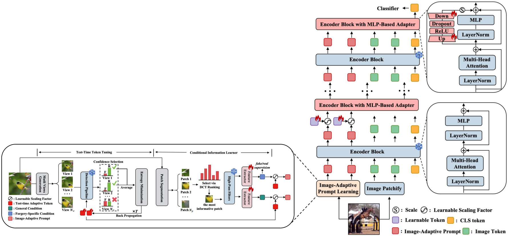
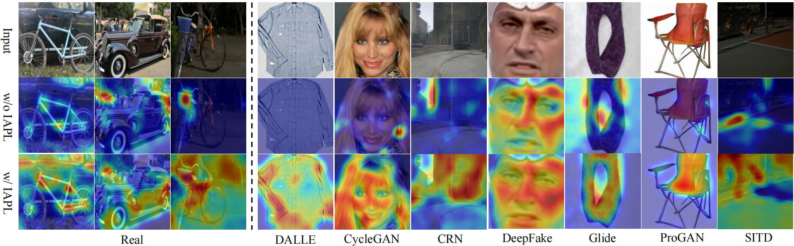

<div align="center">
<!-- <h1>RCTrans</h1> -->
<h3>Towards Generalizable AI-Generated Image Detection via Image-Adaptive Prompt Learning</h3>
<h4>Yiheng Li, Zicahng Tan, Guoqing Xu, Zhen Lei, Xu Zhou and Yang Yang<h4>
<h5>MAIS&CASIA, UCAS, Sangfor<h5>
</div>

[](https://arxiv.org/abs/2508.01603)

## Introduction

This repository is an official implementation of IAPL, codes and weight will be released after paper accepted.

## News
- [2026/3/4] Codes and pre-trained weights are released.
- [2026/2/21] Our paper is accepted by CVPR 2026.

## Methods


## Visualization


## Environment Setting
```
pip install -r requirements.txt
```

## Data Preparation
Download [UniversalFakeDetect](https://github.com/WisconsinAIVision/UniversalFakeDetect) and [GenImage](https://github.com/GenImage-Dataset/GenImage) Datasets.

Organize the directory structure as follows:
```
Datasets
└── UniversalFakeDetect
    └── train
          ├── car
          ├── horse
          │      .
          │      .
    └── test					
          ├── progan	
          │── cyclegan   	
          │── biggan
          │      .
          │      .

└── GenImage
    └── train
          ├── SDv14
              ├── 0_real
              ├── 1_fake

    └── test					
          ├── ADM
              ├── 0_real
              ├── 1_fake
          │── BigGAN   	
          │── glide
          │      .
          │      .
```

## Experiments on 4-Class ProGAN
Training:
```
sh run_universalfake.sh
```
Testing on universalfakedetect:
```
sh tta_universalfake.sh
```
Testing on Chameleon:
```
sh tta_chameleon.sh
```

Results:
| Benchmark |  mACC(%)  |  mAP(%)   | 
| :-------- | :---: | :---: |
| UniversalFakeDetect   | 95.61  | 99.32  |
| Chameleon | 60.70  | 50.43  |

## Experiments on SD v1.4

Training:
```
sh run_genimage.sh
```
Testing on GenImage:
```
sh tta_genimage.sh
```
Testing on Chameleon:
```
sh tta_chameleon_sdv1.4.sh
```

Results:
| Benchmark |  mACC(%)  |  mAP(%)   | 
| :-------- | :---: | :---: |
| GenImage | 96.7  | 99.5  |
| Chameleon | 75.09  | 64.69  |

## Pre-trained Models

We release the pre-trained models on [ModelScope](https://modelscope.cn/models/yihengli/IAPL_pretrain) 

## Acknowledgement

We sincerely thank the following repos: [UniversalFakeDetect](https://github.com/WisconsinAIVision/UniversalFakeDetect), [FatFormer](https://github.com/Michel-liu/FatFormer), [AIDE](https://github.com/shilinyan99/AIDE) and [TPT](https://github.com/azshue/TPT).

## Citation
```
@article{li2025towards,
  title={Towards Generalizable AI-Generated Image Detection via Image-Adaptive Prompt Learning},
  author={Li, Yiheng and Tan, Zichang and Xu, Guoqing and Lei, Zhen and Zhou, Xu and Yang, Yang},
  journal={arXiv preprint arXiv:2508.01603},
  year={2025}}
```
